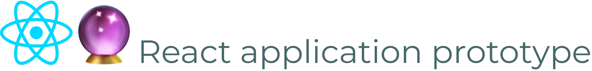

<div align="right">
  <h1>
    
  </h1>

  <!-- prettier-ignore-start -->
  <a href="https://github.com/crystal-ball/react-application-prototype/actions?workflow=CI%2FCD">
    
  </a>
  <a href="https://snyk.io/test/github/crystal-ball/react-app-prototype?targetFile=package.json">
    
  </a>
  <a href="https://dashboard.cypress.io/#/projects/v3cpt4/runs">
    
  </a>
  <a href="https://codeclimate.com/github/crystal-ball/react-application-prototype/test_coverage">
    
  </a>
  <a href="https://codeclimate.com/github/crystal-ball/react-application-prototype/maintainability">
    
  </a>
  <code>:status&nbsp;&nbsp;&nbsp;&nbsp;&nbsp;&nbsp;</code>

  <br />
  <a href="https://zeit.co/crystal-ball/react-application-prototype">
    
  </a>
  <a href="https://renovatebot.com/" target="_blank" rel="noopener noreferrer">
    
  </a>
  <a href="https://commitizen.github.io/cz-cli/">
    
  </a>
  <a href="https://github.com/crystal-ball/react-application-prototype#workspaces/-projects-5b88b5c9af3c0a2186966767/board?repos=195149522" target="_blank" rel="noopener noreferrer">
    
  </a>
  <a href="https://percy.io/Crystal-Ball/react-application-prototype" target="_blank" rel="noopener noreferrer">
    
  </a>
  <a href="./CODE_OF_CONDUCT.md">
    
  </a>
  <code>:integrations</code>

  <br />
  <a href="https://github.com/crystal-ball" target="_blank" rel="noopener noreferrer">
    
  </a>
  <a href="https://github.com/crystal-ball/react-application-prototype" target="_blank" rel="noopener noreferrer">
    
  </a>
  <code>:flair&nbsp;&nbsp;&nbsp;&nbsp;&nbsp;&nbsp;&nbsp;</code>
  <!-- prettier-ignore-end -->

  <h1></h1>
  <br />
  <p align="center">
    <em>Crystal Ball Projects prototypical React application</em>
  </p>
  <br />
</div>

- [Setup](#-setup) - Getting started
- [Testing](#-testing) - Running application test suites
- [Developing](#-developing) - Application development tools and conventions
- [Notes](#-notes) - Conventions and reference documentation

---

## ⚙️ Setup

**1. Install dependencies**

```
npm install
```

## ✅ Testing

The project includes 3 types of testing: static linting, unit testing and
acceptance testing.

**Static linting** uses ESLint with the `eslint-config-eloquence` ruleset.

```
npm run test:lint
```

**Unit testing** uses Jest with `@testing-library/react` and is configured in
`jest.config.js`

```
npm run test:unit
npm run test:watch
```

**Acceptance testing** uses Cypress inside of a Docker Compose environment

```
npm run test:acceptance
```

### Testing patterns

- _React Router_ management requires the addition of a `MemoryRouter` (reference
  the Header component test file)

## 🌱 Development

Start the webpack development server.

```
npm start
```

### Formatting

All JS, JSON, SCSS and markdown files are required to be formatted by Prettier
and can be formatted using the `format` npm command.

## 📝 Notes

_Miscellaneous project notes and explanations_

### Project dependencies

- Jest IntelliSense isn't working unless the `@types/jest` package is installed
  as a project dependency.

## Code coverage deets

Ideal for Cypress:

- Setup to run locally in Docker to mimic CI/CD
- docker-compose.ci.yml with additional env values and --record

Cypress code coverage tutorial:
https://docs.cypress.io/guides/tooling/code-coverage.html

- Add the Babel Istanbul plugin to instrument code, using `BABEL_ENV` to only
  instrument the app for Cypress runs. Ref:
  https://github.com/istanbuljs/babel-plugin-istanbul
- Add Cypress code coverage plugin to report coverage after test run Ref:
  https://github.com/cypress-io/code-coverage
- Configure Cypress coverage to output to `coverage_cypress` Ref:
  https://github.com/istanbuljs/nyc#common-configuration-options
- Configure Jest coverage to output to `coverage_jest` Ref:
  https://jestjs.io/docs/en/configuration#coveragedirectory-string

Possible to get coverage running locally?
